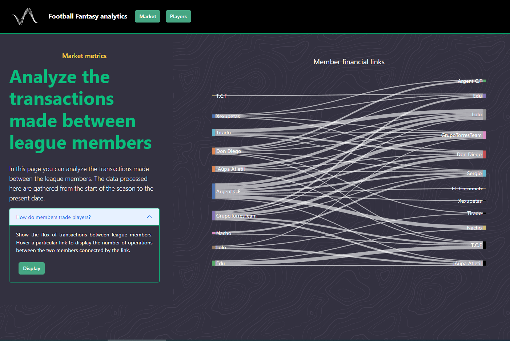
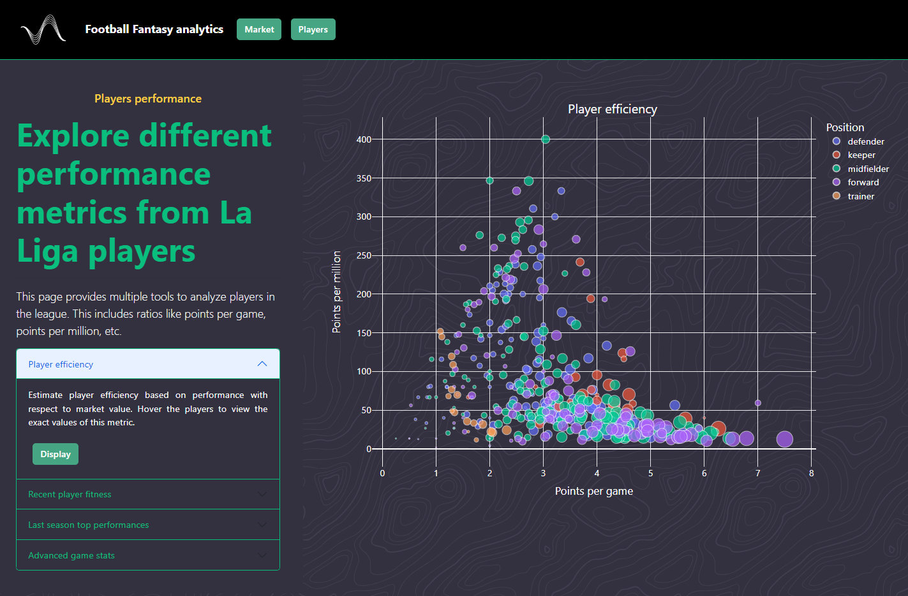

# 0. Disclaimer
This project is currently under development. Some functionalities may not be available yet.
To try this application, run './app/app.py', leave the login form fields blank and click 'Sign in'

# 1. Objective
This project consists of a web application whose objective is twofold: 
- to analyze a Fantasy Football league (transfers, points, player scores, etc).
- to provide advanced statistics for player analysis via multitple chart types and tables.

# 2. Design
The web application is designed as a four element body:
- a navbar to navigate between market/player analysis.
- a sidebar to display the features available for each analysis.
- a core to show the interactive plots.
- a secondary container to display data tables.

# 3. How does it work?
The user logs in using their Fantasy Football credentials (or leaving the form blank
to use a demo account). Subsequently, the app requests the following information:
- market and player data from the Fantasy Football API.
- advanced statistics from the official LaLiga website.
Both data blocks are stored as session dataframes. After this, the application features
are unlocked and the user can perform different analyses.

# 4. Which analyses can I perform?
## 4.1. Market analysis
1. Show the flux of transactions between league members.
   

2. Calculate the financial balance and score of the league members.
   

## 4.2. Player analysis
1. Estimate player efficiency in terms of points per game/million.
   

2. Visualize player recent fitness.
   

3. Check player performance during last season.

4. Compare players using advanced stats.
   

